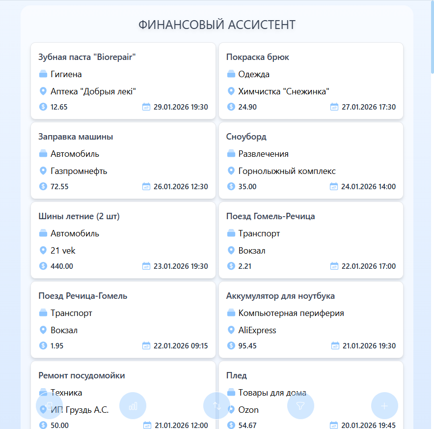
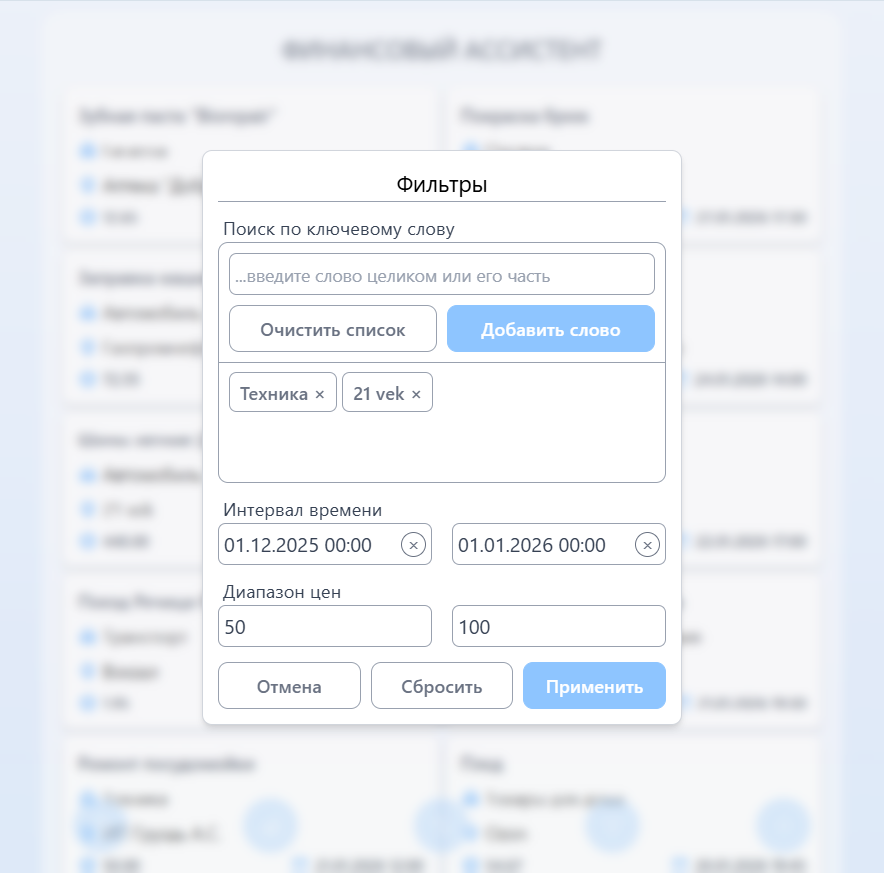

## 🚀 Демо

**[👉 Смотреть работающее приложение](https://financial-assistant-web-livid.vercel.app)** 

*(Нажми на ссылку, чтобы попробовать!)*

 
 

# Финансовый ассистент

## 📋 О проекте

**BudgetFlow** — это fullstack-приложение для управления личными финансами, которое позволяет:
- 📊 **Анализировать расходы** с помощью интерактивных таблицы, диаграммы и графика
- 📱 **Синхронизироваться между устройствами** благодаря облачному бэкенду
- 🔐 **Безопасно хранить данные** с JWT-аутентификацией

Проект построен на современных технологиях (NestJS + PostgreSQL + React) и демонстрирует:
- Чистую архитектуру с разделением на модули
- REST API с валидацией и обработкой ошибок
- Адаптивный интерфейс
- Интерактивную визуализацию данных

## 🛠️ Стек технологий

**Backend:**
- NestJS + TypeScript — основной фреймворк
- PostgreSQL + TypeORM
- Node
- JWT аутентификация

**Frontend:**
- React + TypeScript
- Vite
- Axios
- Tailwind

## 🛠️ Стек технологий

**Backend:**
- [NestJS](https://nestjs.com/) — основной фреймворк
- [PostgreSQL](https://www.postgresql.org/) — база данных
- [TypeORM](https://typeorm.io/) — ORM для работы с БД
- [JWT](https://jwt.io/) — аутентификация
- [Jest](https://jestjs.io/) — тестирование

**Frontend:**
- [React](https://reactjs.org/) — UI библиотека
- [TypeScript](https://www.typescriptlang.org/) — типизация
- [Redux Toolkit](https://redux-toolkit.js.org/) — управление состоянием
- [React Router](https://reactrouter.com/) — навигация
- [Axios](https://axios-http.com/) — HTTP-клиент

## 🛠️ Стек технологий

**Backend:**
- NestJS — основной фреймворк
- PostgreSQL — база данных
- TypeORM — ORM для работы с БД
- [JWT](https://jwt.io/) — аутентификация
- [Jest](https://jestjs.io/) — тестирование

**Frontend:**
- [React](https://reactjs.org/) — UI библиотека
- [TypeScript](https://www.typescriptlang.org/) — типизация
- [Redux Toolkit](https://redux-toolkit.js.org/) — управление состоянием
- [React Router](https://reactrouter.com/) — навигация
- [Axios](https://axios-http.com/) — HTTP-клиент

## 📸 Скриншоты

<table>
  <tr>
    <th width="70%">Главное окно на ПК</th>
    <th width="30%">Главное окно на телефоне</th>
  </tr>
  <tr>
    <td align="center">
      
    </td>
    <td align="center">
      
    </td>
  </tr>
</table>

<table>
  <tr>
    <th width="50%">Добавление и редактирование</th>
    <th width="50%">Статистика</th>
  </tr>
  <tr>
    <td align="center">
      
    </td>
    <td align="center">
      
    </td>
  </tr>
</table>

<table>
  <tr>
    <th width="50%">Фильтры</th>
    <th width="50%">Сортировка</th>
  </tr>
  <tr>
    <td align="center">
      
    </td>
    <td align="center">
      
    </td>
  </tr>
</table>

## 🏗️ Архитектура проекта
FINANCIAL-ASSISTANT/ 
├── frontend/ 
│    ├── src/ 
│    │   ├── components/ 
│    │   │    ├── modules/ 
│    │   │    └── ui/ 
│    │   ├── hooks/ 
│    │   ├── tests/ 
│    │   │    ├── components/ 
│    │   │    │    ├── modules/ 
│    │   │    │    └── ui/ 
│    │   │    ├── hooks/ 
│    │   │    └── utils/ 
│    │   └── utils/ 
│    ├── api.ts 
│    ├── App.css 
│    ├── App.tsx 
│    ├── index.css 
│    ├── main.tsx 
│    └── types.tsx 
├── backend/ 
│    ├── src/ 
│    │   ├── auth/ 
│    │   ├── categories/ 
│    │   │    ├── dto/ 
│    │   │    └── entities/ 
│    │   ├── expenses/ 
│    │   │    ├── dto/ 
│    │   │    └── entities/ 
│    │   ├── locations/ 
│    │   │    ├── dto/ 
│    │   │    └── entities/ 
│    │   ├── tests/ 
│    │   │    ├── auth/ 
│    │   │    ├── categories/ 
│    │   │    ├── expenses/ 
│    │   │    ├── locations/ 
│    │   │    └── users/ 
│    │   ├── users/ 
│    └── main.ts 

## 💾 Схема базы данных

**Основные сущности:**
- `users` — пользователи
- `expenses` — расходы
- `categories` — категории расходов
- `locations` — место совершения расхода

## 🚀 Запуск через Docker

**Требования:** 
- Node.js v22+
- npm или yarn
- Docker
- Docker Compose

#### 1. Клонирование репозитория
git clone https://github.com/paper-apple/financial-assistant-web.git

#### 2. Переход в папку
cd financial-assistant-web

#### 3. Создание .env-файла
cp .env.example .env

#### 4. Установка dotenv
npm install dotenv

#### 5. Запуск сервисов
docker compose up -d

#### 6. Загрузка тестовой БД
npm run db:restore

#### 7. Открытие приложения
http://localhost:5173

## 🚀 Ручной запуск

**Требования:**
- Node.js v22+
- PostgreSQL v17+
- npm или yarn

#### 1. Клонирование репозитория
git clone https://github.com/paper-apple/financial-assistant-web.git

#### 2. Переход в папку
cd financial-assistant-web

#### 3. Создание .env-файла
cp .env.example .env

#### 4. Установка зависимостей
npm run install-deps

#### 5. Создание БД
npm run db:setup

#### 6. Запуск приложения
.\run_all.bat