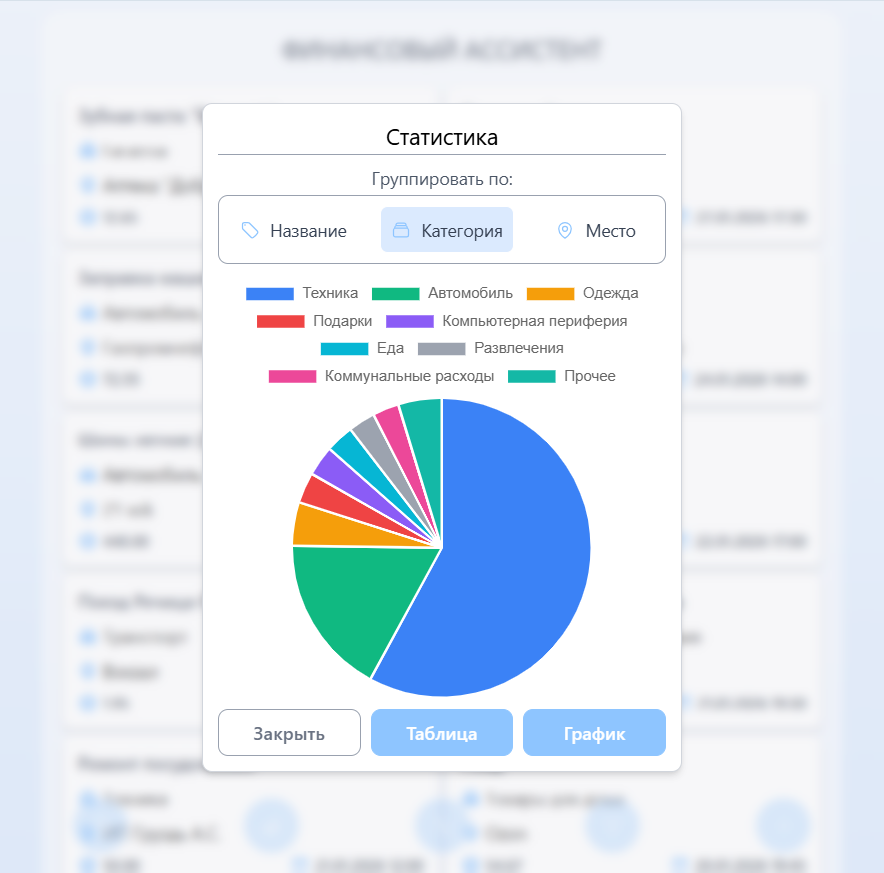
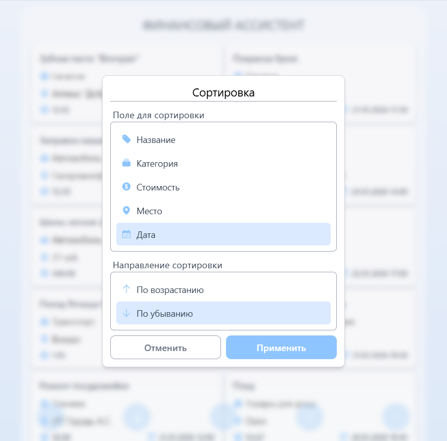
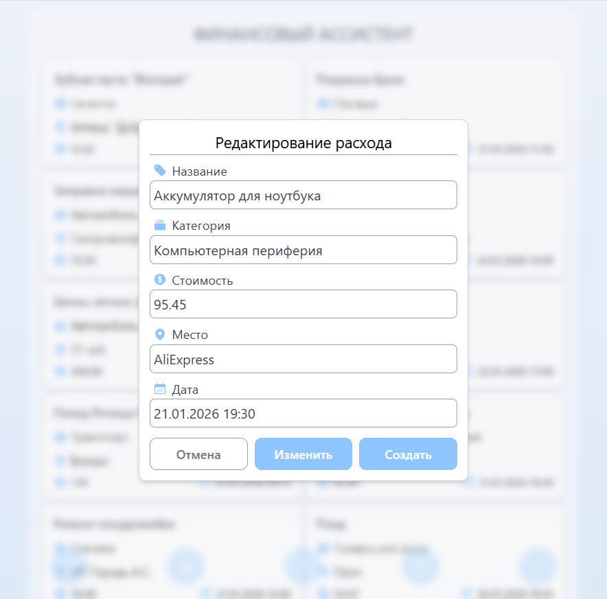
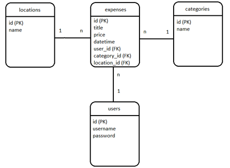

## 🚀 Демо

**[👉 Смотреть работающее приложение](https://financial-assistant-web-livid.vercel.app)** 

*(Нажми на ссылку, чтобы попробовать!)*

 
 

# Финансовый ассистент

## 📋 О проекте

Приложение для ведения бюджета. Предназначено для фиксации расходов и их последующего анализа.

Проект разработан в качестве дипломной работы и демонстрирует навыки fullstack-разработки.

## 🛠️ Стек технологий

**Backend:**
- NestJS + TypeScript
- PostgreSQL + TypeORM
- Node
- JWT аутентификация
- Jest (тестирование)

**Frontend:**
- React + TypeScript
- Vite
- Axios
- Tailwind

## 📸 Скриншоты

| Главное окно на ПК | Главное окно на телефоне |
|:------------------:|:------------------------:|
|  |  |

| Добавление и редактирование | Статистика |
|:------------------:|:------------------------:|
|  |  |

| Фильтры | Сортировка |
|:---------:|:--------:|
|  |  |

| Добавление и редактирование | Статистика |
|:--------------------------:|:----------:|
|  |  |

<table>
  <tr>
    <th width="50%">Добавление и редактирование</th>
    <th width="50%">Статистика</th>
  </tr>
  <tr>
    <td align="center">
      
    </td>
    <td align="center">
      
    </td>
  </tr>
</table>

| | |
|---|---|
|  |  |
| *Окно добавления и редактирования расхода* | *Страница статистики с графиками* |

## 🏗️ Архитектура проекта
FINANCIAL-ASSISTANT/
├── frontend/
│    ├── src/
│    │   ├── components/
│    │   │    ├── modules/
│    │   │    └── ui/
│    │   ├── hooks/
│    │   ├── tests/
│    │   │    ├── components/
│    │   │    │    ├── modules/
│    │   │    │    └── ui/
│    │   │    ├── hooks/
│    │   │    └── utils/
│    │   └── utils/
│    ├── api.ts
│    ├── App.css
│    ├── App.tsx
│    ├── index.css
│    ├── main.tsx
│    └── types.tsx
├── backend/
│    ├── src/
│    │   ├── auth/
│    │   ├── categories/
│    │   │    ├── dto/
│    │   │    └── entities/
│    │   ├── expenses/
│    │   │    ├── dto/
│    │   │    └── entities/
│    │   ├── locations/
│    │   │    ├── dto/
│    │   │    └── entities/
│    │   ├── tests/
│    │   │    ├── auth/
│    │   │    ├── categories/
│    │   │    ├── expenses/
│    │   │    ├── locations/
│    │   │    └── users/
│    │   ├── users/
│    └── main.ts

## 💾 Схема базы данных

**Основные сущности:**
- `users` — пользователи
- `expenses` — расходы
- `categories` — категории расходов
- `locations` — место совершения расхода