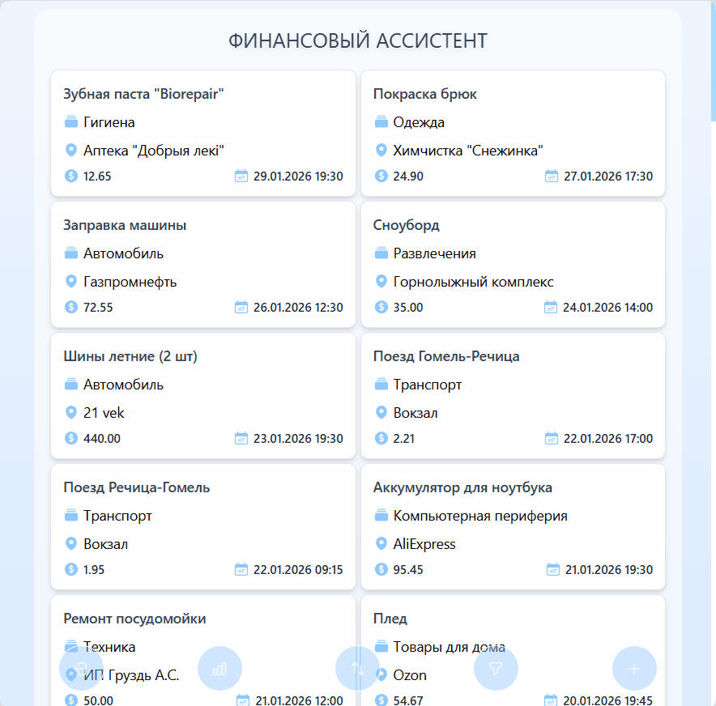
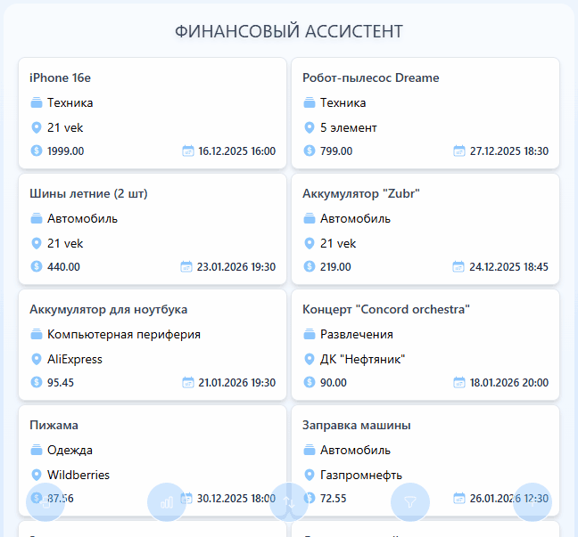
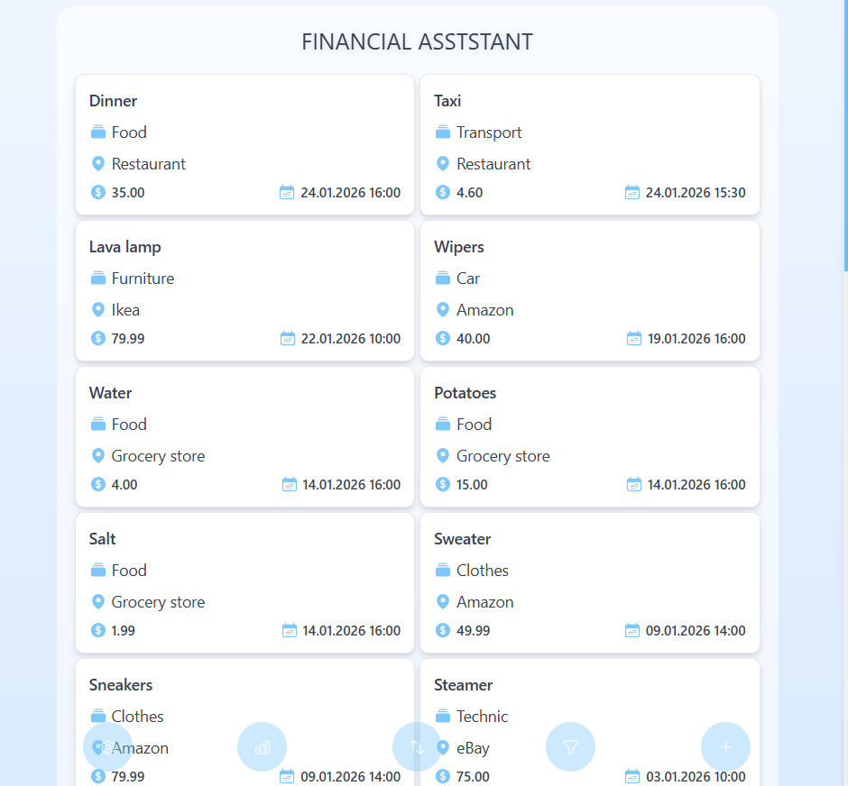
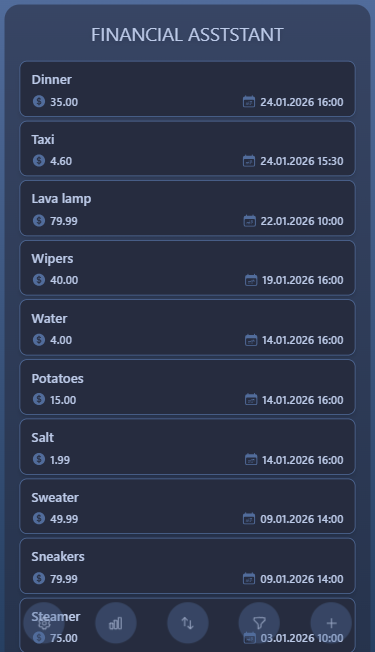
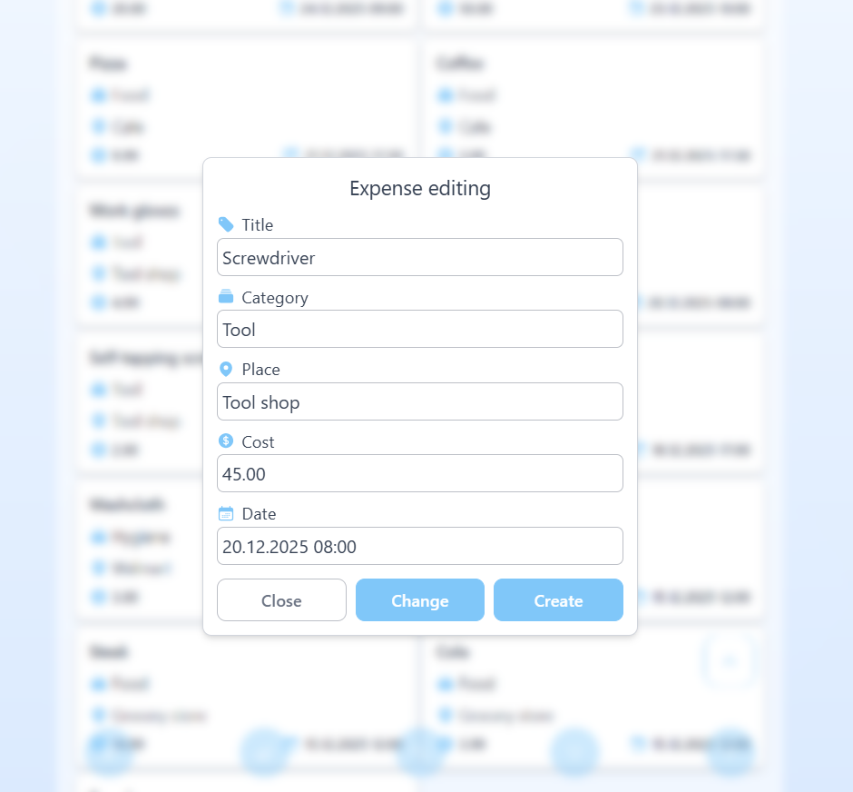
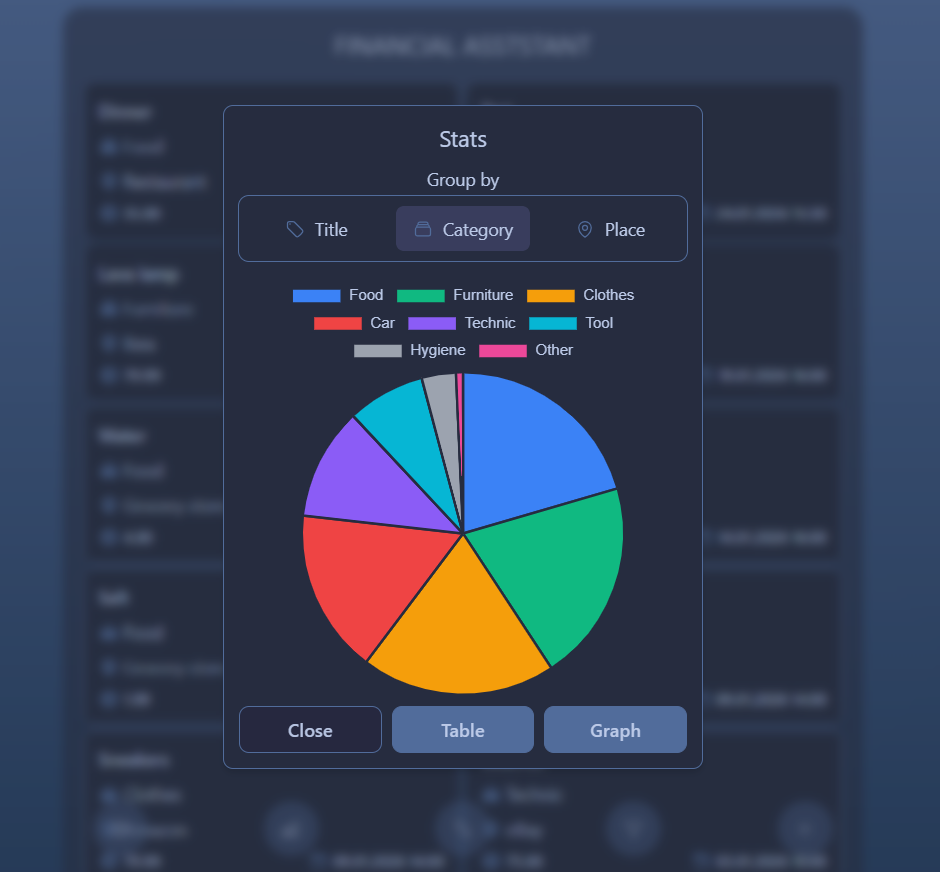
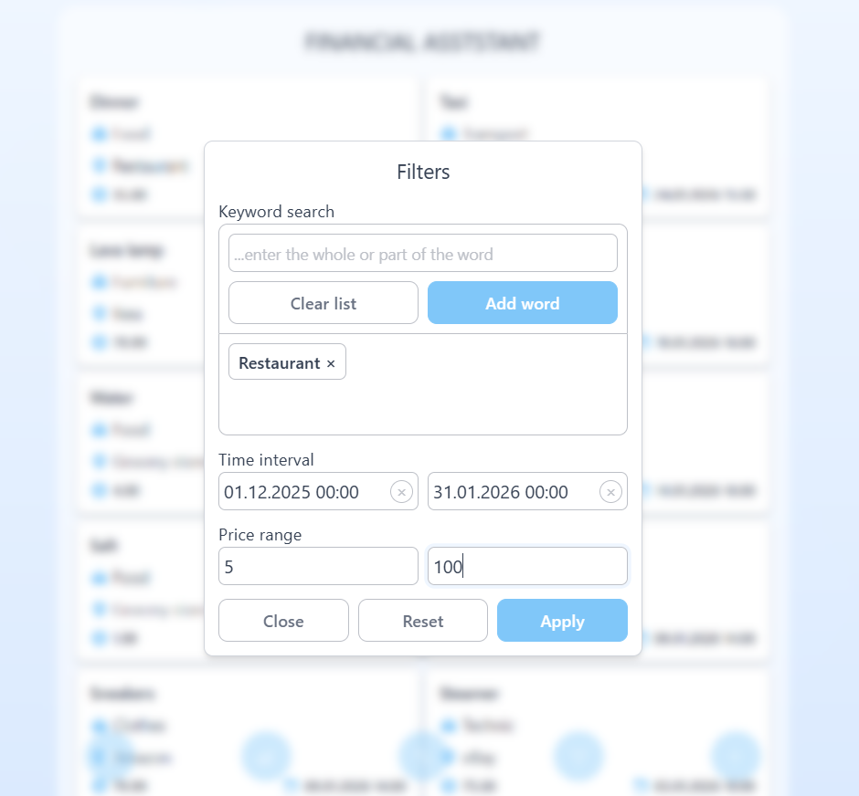
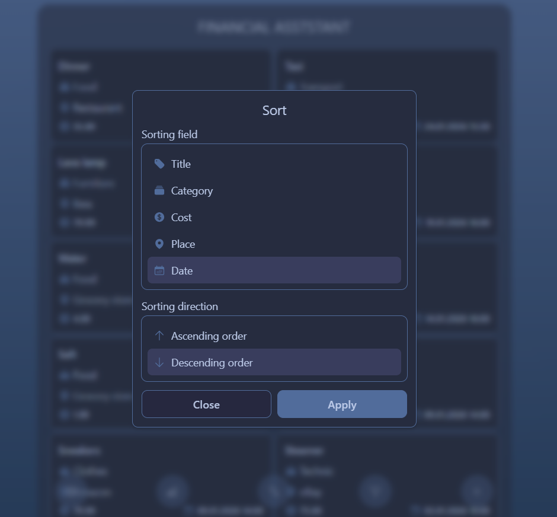

# Financial Assistant

[](https://opensource.org/licenses/MIT)
[](https://github.com/paper-apple/financial-assistant-web/pulls)
[](https://www.typescriptlang.org/)
[](https://reactjs.org/)
[](https://www.postgresql.org/)
[](https://nestjs.com/)

<p align="left">
  <a href="README.ru.md">Русский</a>
</p>

## 📋 About the Project

Financial Assistant is a fullstack personal finance management application that allows users to:

- Manage and analyze expenses
- Work across multiple devices with cloud synchronization
- Store data securely

Built with **NestJS + PostgreSQL + React**, the project demonstrates:

- Clean modular architecture
- REST API with validation and error handling
- Responsive user interface
- Interactive data visualization

## ▶️ Demo

**[Try the live app](https://financial-assistant-web-livid.vercel.app)**

<table>
  <tr>
    <th width="50%">Expense Management</th>
    <th width="50%">Expense Analytics</th>
  </tr>
  <tr>
    <td align="center">
      
    </td>
    <td align="center">
      
    </td>
  </tr>
</table>

## ⚙️ Features

- Create, edit, and delete expense records
- Filter by date, amount, and keywords
- Sort by any field (title, category, location, amount, date)
- Smart autocomplete suggestions
- Table, charts, and graphs for analytics
- Secure registration and login (JWT)
- Cross-device synchronization (cloud version)
- Fully responsive interface

## 🛠️ Tech Stack

**Backend:**
- NestJS + TypeScript
- PostgreSQL + TypeORM
- Node.js
- JWT Authentication

**Frontend:**
- React + TypeScript
- Vite
- Axios
- Tailwind CSS

## 📸 UI Screenshots

<table>
  <tr>
    <th width="64%">Desktop Main View</th>
    <th width="36%">Mobile Main View</th>
  </tr>
  <tr>
    <td align="center">
      
    </td>
    <td align="center">
      
    </td>
  </tr>
</table>

<table>
  <tr>
    <th width="50%">Add & Edit</th>
    <th width="50%">Statistics</th>
  </tr>
  <tr>
    <td align="center">
      
    </td>
    <td align="center">
      
    </td>
  </tr>
</table>

<table>
  <tr>
    <th width="50%">Filters</th>
    <th width="50%">Sorting</th>
  </tr>
  <tr>
    <td align="center">
      
    </td>
    <td align="center">
      
    </td>
  </tr>
</table>

## 🧱 Project Architecture

<details>
<summary>Click to expand</summary>

FINANCIAL-ASSISTANT/<br>
├── backend/<br>
│   ├── src/<br>
│   │   ├── auth/          # Authentication<br>
│   │   ├── users/         # Users<br>
│   │   ├── categories/    # Expense categories<br>
│   │   ├── expenses/      # Transactions<br>
│   │   ├── locations/     # Purchase locations<br>
│   │   ├── tests/         # Tests<br>
│   │   ├── app.module.ts  # Root module<br>
│   │   └── main.ts        # Entry point<br>
│   ├── package.json<br>
│   ├── nest-cli.json<br>
│   └── Dockerfile<br>
│<br>
├── frontend/<br>
│   ├── src/<br>
│   │   ├── components/    # UI components<br>
│   │   │   ├── ui/        # Base components<br>
│   │   │   └── modules/   # Complex modules<br>
│   │   ├── hooks/         # Custom hooks<br>
│   │   ├── utils/         # Utilities<br>
│   │   ├── context/       # Context<br>
│   │   ├── i18n/          # Translations<br>
│   │   ├── tests/         # Tests<br>
│   │   ├── api.ts         # API client<br>
│   │   ├── App.tsx        # Root component<br>
│   │   └── main.tsx       # Entry point<br>
│   ├── package.json<br>
│   ├── vite.config.ts<br>
│   └── Dockerfile<br>

</details>

## 💾 Database Schema

<div align="center">


</div>

**Core entities:**
- `users`
- `expenses`
- `categories`
- `locations`

## 🧪 Testing

The project includes basic test coverage for key modules.

**Backend:**
- Service unit tests (Auth, Expenses)

**Frontend:**
- UI component tests (Button, Input, Modal)
- Utility tests (formatting, validation)

**Run tests:**
```bash
npm run run-all-tests
```

## 📈 Roadmap

- [x] Dark mode
- [ ] Change password and username
- [ ] Multi-currency support with real-time exchange rates
- [ ] Expense limit management
- [ ] Expense forecasting
- [ ] Advanced analytics
- [ ] Integration tests
- [ ] Data caching
- [ ] Import and export

## 🐳 Run with Docker

**Requirements:** 
- [Docker](https://docker.com)
- [Docker Compose](https://docs.docker.com/compose/)

**1. Clone the repository:**
```bash
git clone https://github.com/paper-apple/financial-assistant-web.git
cd financial-assistant-web
```

**2. Create an .env file from the example:**
```bash
npm run setup-env
```

**3. Launch Docker Desktop**
> Wait until Docker is fully started (status "Running")

**4. Launch containers:**
```bash
docker compose up -d
```

**5. Load test data into the database:**
```bash
npm run db:restore
```

**6. Start the application:**<br>
- The application is available at: [http://localhost:5173](http://localhost:5173)

## 🖐️ Manual setup

**Requirements:**
- Node.js v22+
- PostgreSQL v17+
- npm or yarn

**1. Clone the repository:**
```bash
git clone https://github.com/paper-apple/financial-assistant-web.git
cd financial-assistant-web
```

**2. Create an .env file from the example:**
```bash
npm run setup-env
```

**3. Install dependencies (backend + frontend):**
```bash
npm run install-deps
```

**4. Create and set up the database:**
```bash
npm run db:setup
```

**5. Start the application:**
- Automatic launch:
```bash
node start.js
```
- Manual launch:
```bash
cd backend; npm run start:dev # Terminal 1
```
```bash
cd frontend; npm run dev # Terminal 2
```

**6. Open the application:**<br>
- The application is available at: [http://localhost:5173](http://localhost:5173)

## 📞 Contact

[](birdcherrytea@gmail.com)</br>
[](https://t.me/submarino_amarillo)</br>
[](https://www.linkedin.com/in/dzmitry-paklonski/)