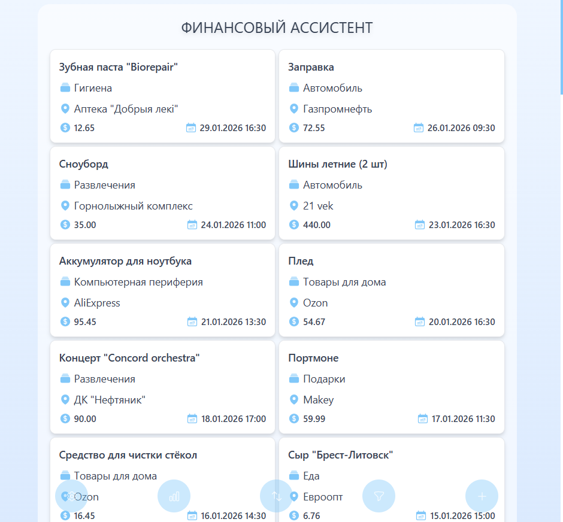
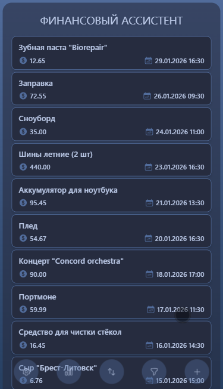
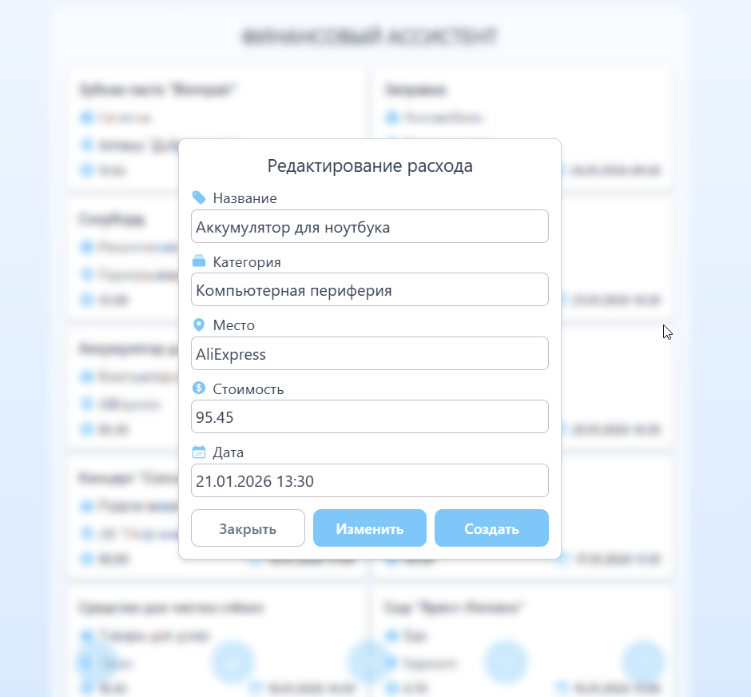
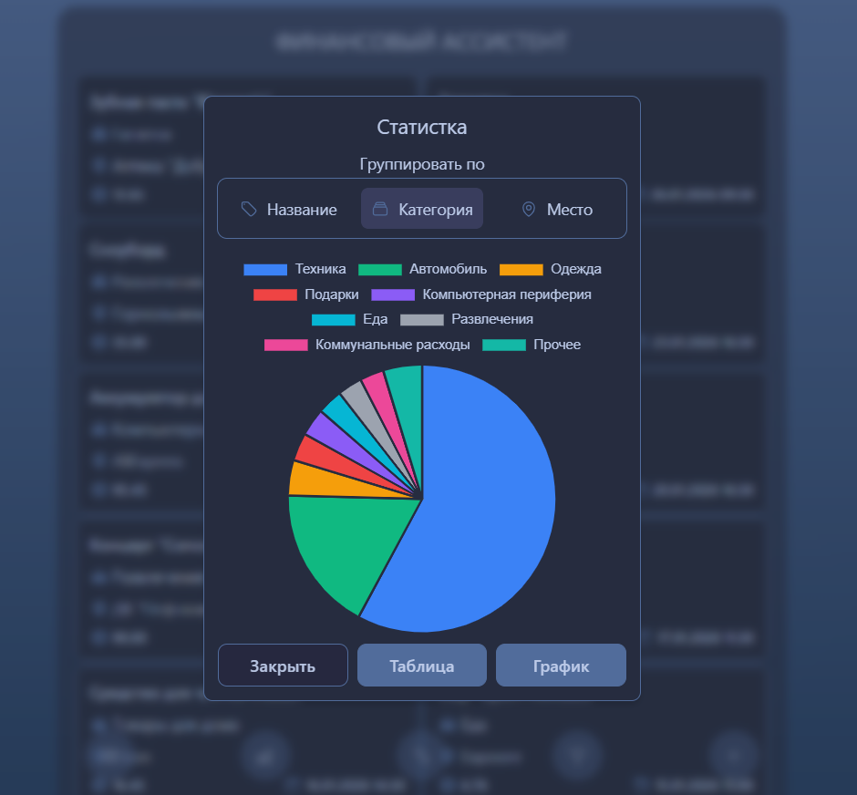
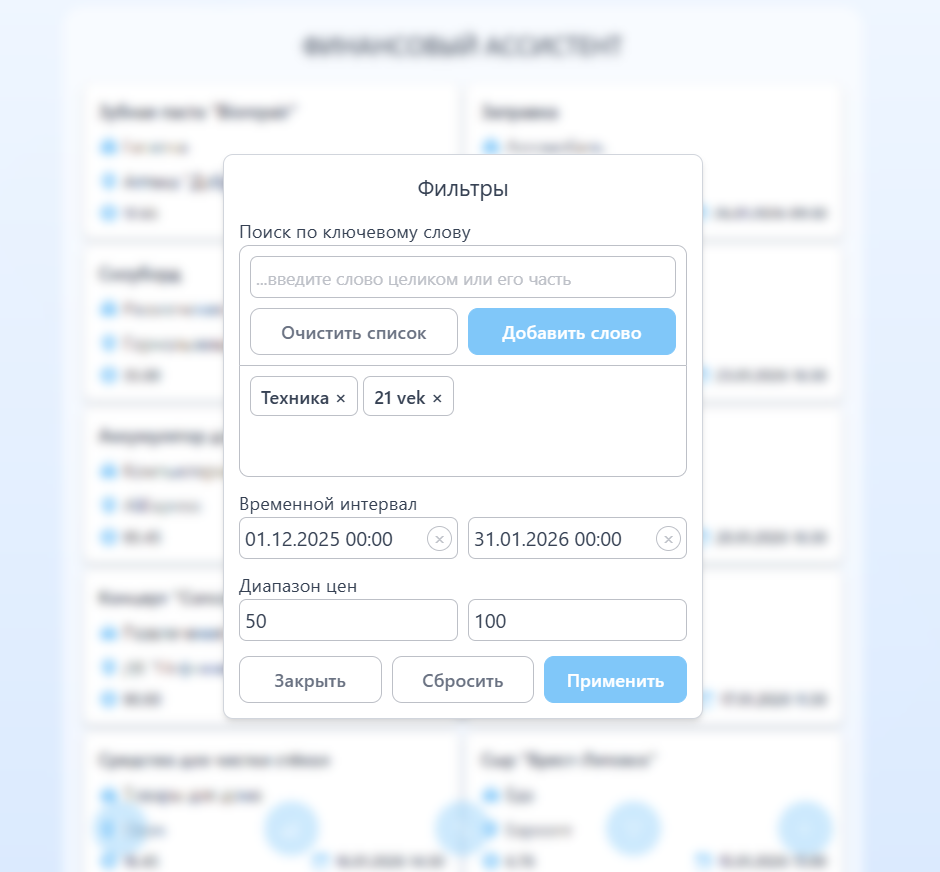
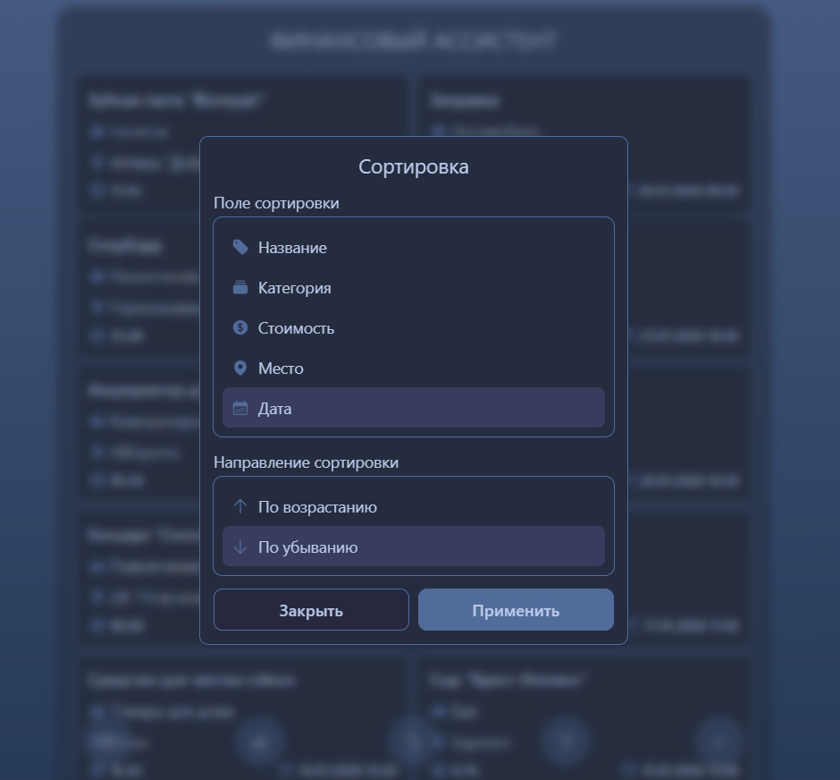

# Financial Assistant

[](https://opensource.org/licenses/MIT)
[](https://github.com/paper-apple/financial-assistant-web/pulls)
[](https://www.typescriptlang.org/)
[](https://reactjs.org/)
[](https://www.postgresql.org/)
[](https://nestjs.com/)

<p align="left">
  <a href="README.md">English</a>
</p>

## 📋 О проекте

Financial Assistant — это fullstack-приложение для управления финансами, которое позволяет:
- Взаимодействовать с расходами и анализировать их
- Использовать различные устройства для работы и синхронизироваться между ними
- Безопасно хранить данные

Проект построен на технологиях NestJS + PostgreSQL + React и демонстрирует:
- Чистую архитектуру с разделением на модули
- REST API с валидацией и обработкой ошибок
- Адаптивный интерфейс
- Интерактивную визуализацию данных

## ▶️ Демо

**[Попробовать приложение онлайн](https://financial-assistant-web-livid.vercel.app)** 

<table>
  <tr>
    <th width="50%">Взаимодействие с записями</th>
    <th width="50%">Анализ записей</th>
  </tr>
  <tr>
    <td align="center">
      
    </td>
    <td align="center">
      
    </td>
  </tr>
</table>

## ⚙️ Функциональность

- Добавление, редактирование и удаление записей
- Фильтрация по дате, цене и ключевым словам
- Сортировка по любому полю (название, категория, локация, сумма, дата)
- Система подсказок при заполнении полей (автодополнение)
- Таблица, диаграмма и график для анализа
- Регистрация и безопасный вход (JWT)
- Синхронизация между устройствами (в облачной версии)
- Адаптивный интерфейс для различных устройств

## 🛠️ Стек технологий

**Backend:**
- NestJS + TypeScript — основной фреймворк
- PostgreSQL + TypeORM
- Node.js
- JWT-аутентификация

**Frontend:**
- React + TypeScript
- Vite
- Axios
- Tailwind

## 📸 Скриншоты интерфейса

<table>
  <tr>
    <th width="64%">Главное окно на ПК</th>
    <th width="36%">Главное окно на телефоне</th>
  </tr>
  <tr>
    <td align="center">
      
    </td>
    <td align="center">
      
    </td>
  </tr>
</table>

<table>
  <tr>
    <th width="50%">Добавление и редактирование</th>
    <th width="50%">Статистика</th>
  </tr>
  <tr>
    <td align="center">
      
    </td>
    <td align="center">
      
    </td>
  </tr>
</table>

<table>
  <tr>
    <th width="50%">Фильтры</th>
    <th width="50%">Сортировка</th>
  </tr>
  <tr>
    <td align="center">
      
    </td>
    <td align="center">
      
    </td>
  </tr>
</table>

## 🧱 Архитектура проекта
<details>
<summary>Нажмите, чтобы развернуть</summary>

FINANCIAL-ASSISTANT/<br>
├── backend/<br>
│   ├── src/<br>
│   │   ├── auth/          # Аутентификация<br>
│   │   ├── users/         # Пользователи<br>
│   │   ├── categories/    # Категории расходов<br>
│   │   ├── expenses/      # Транзакции<br>
│   │   ├── locations/     # Места покупок<br>
│   │   ├── tests/         # Тесты<br>
│   │   ├── app.module.ts  # Корневой модуль<br>
│   │   └── main.ts        # Точка входа<br>
│   ├── package.json<br>
│   ├── nest-cli.json<br>
│   └── Dockerfile<br>
│<br>
├── frontend/<br>
│   ├── src/<br>
│   │   ├── components/    # UI-компоненты<br>
│   │   │   ├── ui/        # Базовые (кнопки, инпуты)<br>
│   │   │   └── modules/   # Сложные (формы, таблицы)<br>
│   │   ├── hooks/         # Кастомные хуки<br>
│   │   ├── utils/         # Утилиты<br>
│   │   ├── context/       # Контекст<br>
│   │   ├── i18n/          # Словарь переводов<br>
│   │   ├── tests/         # Тесты<br>
│   │   ├── api.ts         # API-клиент<br>
│   │   ├── App.tsx        # Корневой компонент<br>
│   │   └── main.tsx       # Точка входа<br>
│   ├── package.json<br>
│   ├── vite.config.ts<br>
│   └── Dockerfile<br>
│<br>
├── db/ # Дампы<br>
│<br>
├── scripts/               # Вспомогательные скрипты<br>
│   ├── install-deps.js    # Установка зависимостей<br>
│   ├── restore-db.js      # Загрузка тестовых данных<br>
│   └── setup-db.js        # Создание базы данных<br>
│<br>
├── docker-compose.yml     # Оркестрация контейнеров<br>
├── .env.example           # Пример переменных<br>
└── README.md<br>

</details>

## 💾 Схема базы данных

<div align="center">


</div>

**Основные сущности:**
- `users` — пользователи
- `expenses` — расходы
- `categories` — категории расходов
- `locations` — место совершения расхода

## 🧪 Тестирование

В проекте реализовано базовое тестирование ключевых модулей:

**Backend:**
- Unit-тесты сервисов (Auth, Expenses)

**Frontend:**
- Тесты UI-компонентов (Button, Input, Modal)
- Тесты утилит (форматирование, валидация)

**Запуск тестов:**
```bash
npm run run-all-tests
```

## 📈 Планы развития

- [x] Ночная тема
- [ ] Возможность смены пароля и имени пользователя
- [ ] Мультивалютность, отслеживание курса валют в реальном времени
- [ ] Возможность установки лимита расходов
- [ ] Прогнозирование расходов
- [ ] Продвинутая статистика
- [ ] Интеграционные тесты
- [ ] Кэширование данных
- [ ] Импорт и экспорт данных

## 🐳 Запуск через Docker

**Требования:** 
- [Docker](https://docker.com)
- [Docker Compose](https://docs.docker.com/compose/)

**1. Клонируйте репозиторий:**
```bash
git clone https://github.com/paper-apple/financial-assistant-web.git
cd financial-assistant-web
```

**2. Создайте .env файл из примера:**
```bash
npm run setup-env
```

**3. Запустите Docker Desktop**
> Дождитесь, пока Docker полностью запустится (статус "Running")

**4. Запустите контейнеры:**
```bash
docker compose up -d
```

**5. Загрузите тестовые данные в базу данных:**
```bash
npm run db:restore
```

**6. Откройте приложение:**<br>
- Приложение доступно по адресу: [http://localhost:5173](http://localhost:5173)

## 🖐️ Ручной запуск

**Требования:**
- Node.js v22+
- PostgreSQL v17+
- npm или yarn

**1. Клонировать репозиторий:**
```bash
git clone https://github.com/paper-apple/financial-assistant-web.git
cd financial-assistant-web
```

**2. Создать .env файл из примера:**
```bash
npm run setup-env
```

**3. Установить зависимости (backend + frontend):**
```bash
npm run install-deps
```

**4. Создать и настроить базу данных:**
```bash
npm run db:setup
```

**5. Запустить приложение:**
- Автоматический запуск:
```bash
node start.js
```
- Ручной запуск:
```bash
cd backend; npm run start:dev # Терминал 1
```
```bash
cd frontend; npm run dev # Терминал 2
```

**6. Открыть приложение:**<br>
- Приложение доступно по адресу: [http://localhost:5173](http://localhost:5173)

## 📞 Контакты

[](birdcherrytea@gmail.com)</br>
[](https://t.me/submarino_amarillo)</br>
[](https://www.linkedin.com/in/dzmitry-paklonski/)